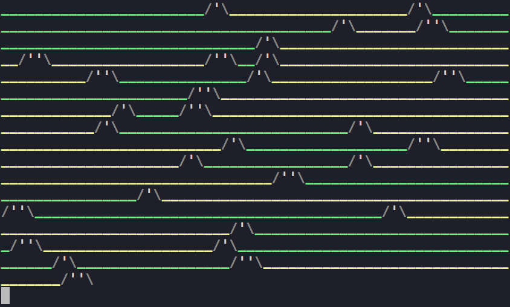

# terra-form

Terra form is a terminal ASCII Art node script that generates color terrain filled with mountains, plains, and deserts.



Or here is the [text output](output/example.txt)

### Instructions

When in this directory run

```
npm install
```

To start the script run (make sure you have node.js installed)

```
node app.js
```

Another script saves the artwork into the ```output``` folder

```
node app2.js
```

Enjoy the terrains!
