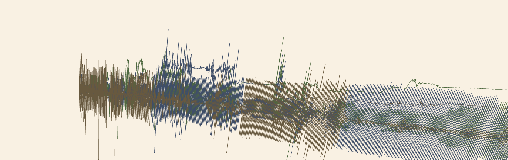
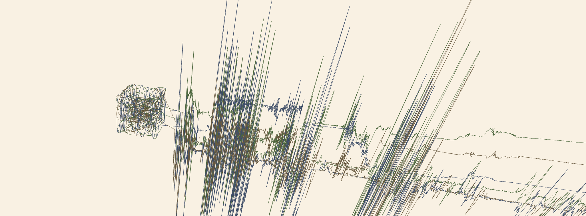
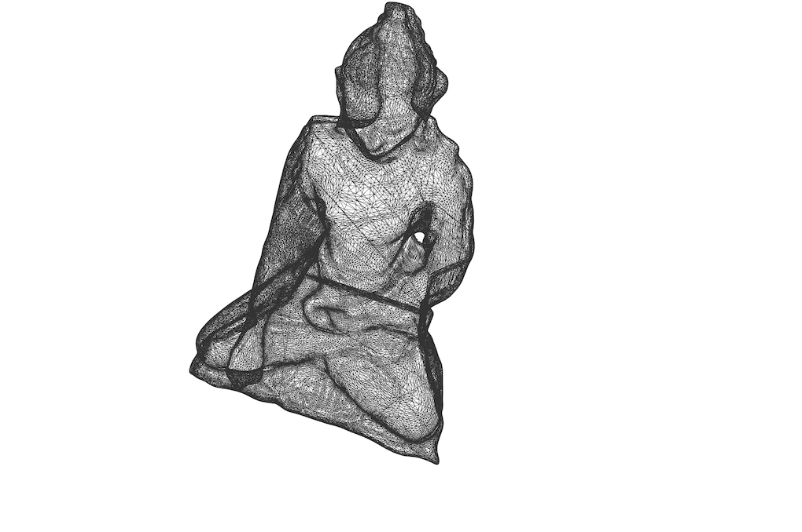
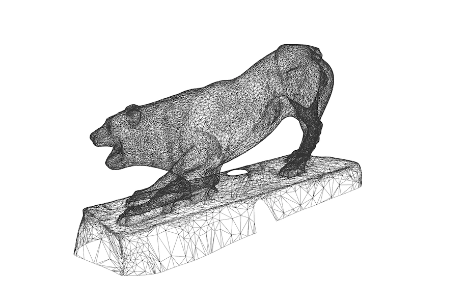
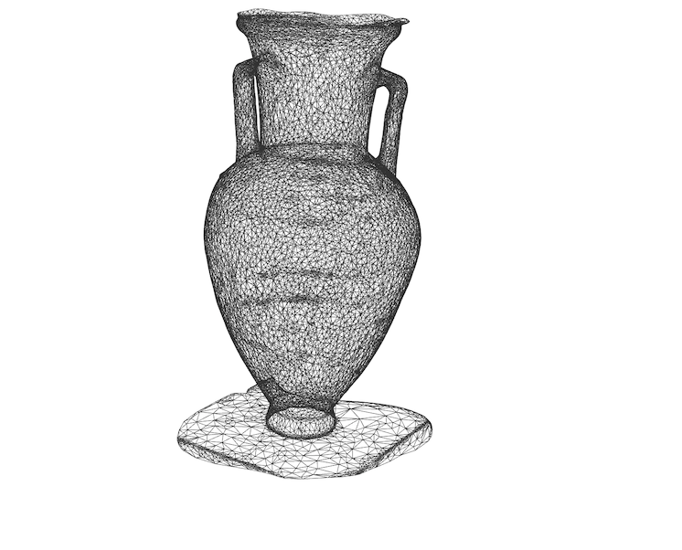
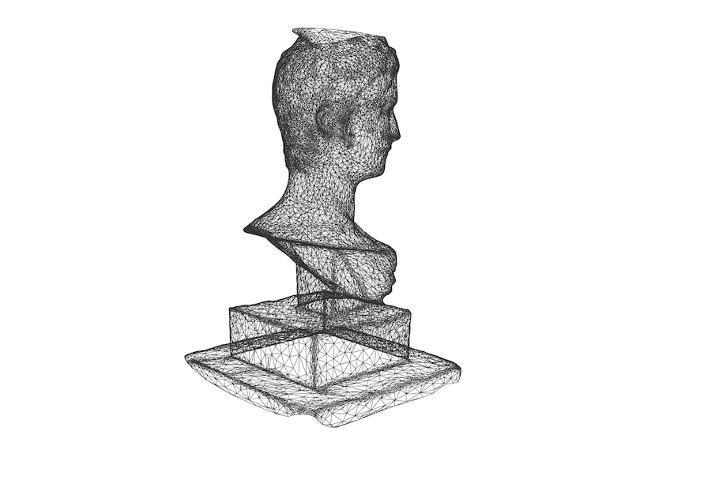
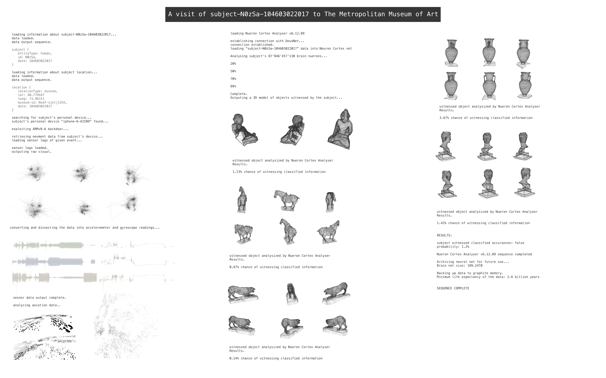

# museum-visualization

A visualization of sensor data collected with a phone during a visit to the The Metropolitan Museum of Art.

Using three.js and WebGL

## [01](01/index.html)

My museum walk represented in accelerometer and gyro readings.
The positioning of the coordinates depends on the x, y, and z readings.

## [02](02/index.html)

My museum walk represented in accelerometer and gyro readings.
The coordinates are represented in a graph-like style.

## [03](03/index.html)

The *Data Altar* of my museum walks.

## [04](04/index.html)

## [05](05/index.html)

## [06](06/index.html)

## [07](07/index.html)

## [08](08/index.html)

## Combined Visualization

This is a speculative narrative that I decided to combine with the visualization. I imagined a world where people are treated as *data subjects* or entities who's actions and subjective experiences can be quantified and determined. This can potentially undermine the very notion of art, as technologic advancements in brain-computer interfaces seem to be the perfect mean towards such an end.  

### Notes

Click on the titles to run in browser.
