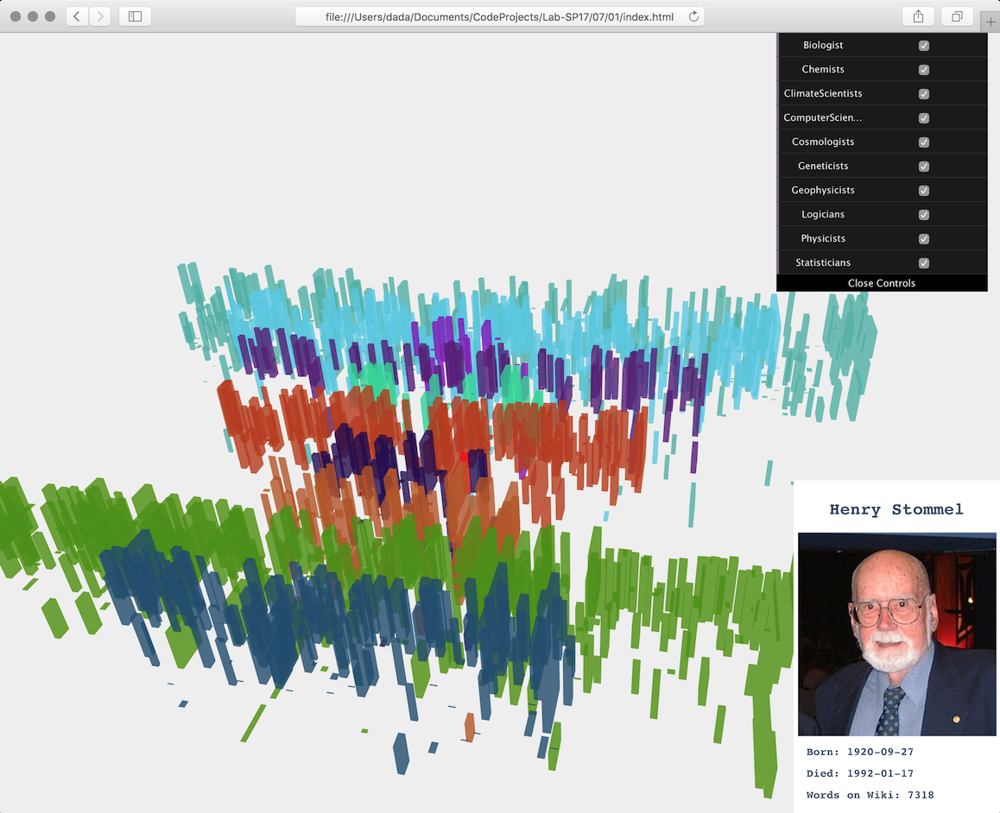

# Wiki Faces

### [Link to Visualization](./01)

Wiki Faces is a project that aims to visualize the life spans and portraits of human figures who constitute the sums of our current scientific knowledge. Wikipedia is the most popular  knowledge reference which functions on a technology that completely transformed the way humans retrieve knowledge – the Internet. With this in mind, Wikipedia continues to be one of the most predominant organizations which represents the openness of the Internet. It is believed among some people that in case of a distress that humanity may encounter, Wikipedia would be on of the first sums of human knowledge that would be salvaged.

Events like the destruction of [Library of Alexandria](https://en.wikipedia.org/wiki/Library_of_Alexandria) during the Muslim conquest of Egypt in AD 642, demonstrated how one of the most valuable resources of human knowledge perished following an unfortunate event. Wikipedia has a page dedicated to [Terminal Event Management Policy](https://en.wikipedia.org/wiki/Wikipedia:Terminal_Event_Management_Policy) which outlines the steps that must me undertaken in order to safeguard the content of the encyclopedia.

*The destruction of Library of Alexandria. It was one of the largest and most significant libraries of the ancient world, almost like Wikipedia is today.*

With this in mind, *Wiki Faces* aims to visualize and represent the faces of people who contributed to the establishment of this sum of human collective knowledge. Without biologist, chemists, historians and thousands of other types of human figures, there would not be sufficient human curiosity for something like an encyclopedia or a Wikipedia to even come into existence.

The visualization is divided into categories of scientists where each is represented by a timeline based on their date of birth and death, and the height of their box  reflects the amount of text that is written about them on Wikipedia.
