<<<<<<< HEAD
<h1>api_final</h1>
<p>api final</p>
<h2>Описание проекта: README.md</h2>
<p>Выполненный проект должен сопровождаться описанием.</p>
<ul>
<li>[ ] <strong>Описание</strong>. Что это за проект, какую задачу он решает, в чём его польза;</li>
<li>[ ] <strong>Установка</strong>. Как развернуть проект на локальной машине;</li>
<li>[ ] <strong>Примеры</strong>. Некоторые примеры запросов к API.</li>
</ul>
<h1>api_yatube</h1>
<p>api_yatube</p>
<h1>asciify</h1>
<p>An image uploader that converts colored images into ASCII art</p>
<h3>Instructions</h3>
<ol>
<li>Run <code>npm install</code></li>
<li>Serve <code>node app.js</code></li>
<li>Go to <code>localhost:3000</code> on your browser</li>
</ol>
<h3>Requirements</h3>
<p>The <code>jp2a</code> bash command must be installed on the system</p>
<h1>Extensions of Bias</h1>
<p>A new media art installation connected to the Internet through a Twitter API. A speculation on how media technology is actively shaping our increasingly biased human natures.</p>
<h1>Circularis</h1>
<p>A project that manifests the aesthetics of generative music patterns through the use of Euclidean geometries and mathematical sequences.</p>
<h2>Contexts</h2>
<p><a href="https://aeon.co/essays/soon-we-will-see-chrono-attached-to-every-form-of-medicine">Life in Circadia</a> by Jessa Gamble</p>
<h1>Code2-SP16</h1>
<p>Code from Code 2 class at Parsons BFADT</p>
<p><strong>Instructor</strong>: <a href="https://github.com/whoisbma">Bryan Ma</a></p>
<p>Spring 2016</p>
<h1>DataSeek</h1>
<p>Exploring the undefined boundaries of rational and irrational data</p>
<h1>Digital Archeology</h1>
<p>PUDT 3000 Final<br />
May 2017</p>
<h2>Narrative</h2>
<h3>Chapter I: The Cosmic Present-Past</h3>
<p>Whenever we take a glimpse at the night sky, most of us rarely realize that what we are looking at--is history. Whatever we see in the night sky, is a collection of photons that have traveled for thousands and millions of years from their point of origin. The photons coming from Alpha Centauri for example--our closest neighboring stellar system--is already 4.3 years old by the time it reaches our telescopes. When we look at the center of our galaxy, we see light that is 27,000 years old. When we observe Andromeda, our neighboring galaxy, we see light that is 2.5 million years old. Our night sky is filled with the cosmic past, and the gigabytes of data collected by our telescopes. This data has yet to be 'excavated' and reveal a cosmic secret lurking among the data. The sky, can be considered an opaque sediment through which the universe's timeline can be observed. Just by looking at the sky, we become archeologists--engaged in the excavation of the past.</p>
<h3>Chapter II: Primeval Ocean</h3>
<p>Before the cosmos gained the ability to host any sense of history, it resembled a turbulent and chaotic ocean. Nothing made sense in the beginning and there was little space for history. But as time unfolded, structure started to prevail--out of what initially was meaningless and unstructured chaos.</p>
<p>These are a few artifacts that are part of human history which emerged out of their chaotic background.</p>
<h3>Chapter III: Creation of Meaning</h3>
<p>As artifacts become introduced in human history, so is meaning. Objects are valued for their inner qualities and this is what makes history itself meaningful. Each historic artifact possesses its own inner world. It is therefore up to the excavators to choose which tools to use in order to excavate an artifact's past.</p>
<p>But are all tools able to reveal the meaningfulness of an artifact? Can excavation tools account all meaningfulness of its objects, or is there something that excavation tools omit?</p>
<p>Zoom into the artifacts using the MOUSE WHEEL to reveal their inner world.</p>
<h3>Chapter IV: Digitization</h3>
<p>Today, digitization has become the current tool for excavating and revealing the past. By taking radio-telescope readings of the night sky, 3D scans of ancient Egyptian statues along with carbon dating techniques--humans engage in a excavation process that transforms every form of history, into a digitized past--a collection of data.</p>
<p>Data is the holy grail of ordering chaos and transforming it into order. If this is the current trend in archeology, then what does it do to the value of the artifacts?</p>
<h3>Chapter V: Anthropic Artifacts</h3>
<p>When we take a look at archaeologic artifacts, how do we want to treat and consider them? Should we stop digitizing the past, and learn how to appreciate it as something that is beyond mere information, but that of eternal value, humanistic, and infinite? Should we return to worshiping Pharaohs like Ancient Egyptians did, or Egyptians did Zeus, or Romans did Jupiter? Could digitizing the past be the most logical and obvious thing to do?</p>
<h3>Chapter VI: The End</h3>
<p>Take a moment to enjoy these digitized artifacts. Some of these would probably disintegrate after a few millions of years, but maybe their digital replica's would exist for longer. </p>
<h2>Todo</h2>
<h3>General</h3>
<ul>
<li>[x] Draft a Narrative</li>
<li>[x] Get the text captions or speech working</li>
<li>[x] Include the narrative as text or speech</li>
<li>[x] Finish project Description</li>
<li>[x] Make a project title screen, name, date, etc.</li>
<li>[x] Polish Attract Mode</li>
<li>[ ] Finish scenes</li>
<li>[x] Scene 1<ul>
<li>[x] narrative</li>
</ul>
</li>
<li>[x] Scene 2<ul>
<li>[x] narrative</li>
</ul>
</li>
<li>[x] Scene 3<ul>
<li>[x] narrative</li>
</ul>
</li>
<li>[x] Scene 4<ul>
<li>[x] narrative</li>
</ul>
</li>
<li>[x] Scene 5<ul>
<li>[ ] narrative</li>
</ul>
</li>
<li>[x] Scene 6<ul>
<li>[ ] narrative</li>
</ul>
</li>
<li>[ ] Scene 7<ul>
<li>[ ] narrative</li>
</ul>
</li>
<li>[ ] Scene 8<ul>
<li>[ ] narrative</li>
</ul>
</li>
<li>[ ] Scene 9<ul>
<li>[ ] narrative</li>
</ul>
</li>
<li>[ ] Music Setup</li>
<li>[x] Bug Fixing</li>
</ul>
<h3>Visual Stuff and Misc</h3>
<ul>
<li>[ ] Scene transitions</li>
<li>[x] Add new forms of visuals</li>
<li>[ ] Add more 3D models</li>
<li>[ ] Decrease poly count of 3D models if necessary</li>
</ul>
<h3>Other Stuff</h3>
<h2>Endeavour's Guide for the 21st Century</h2>
<p>A project based on on reviving James Cook's geographic discoveries that where made while he was the captain of <em><a href="https://en.wikipedia.org/wiki/HMS_Endeavour">Endeavour</a></em>. The device is capable of displaying the direction it is directed by using three 7 segment displays.</p>
<h3>Showcase</h3>
<p><a href="https://youtu.be/tzNWS7Lbi3c">The Endeavour Test</a> - YouTube video</p>
<p><a href="https://i.imgur.com/okikHWv.jpg">Project Plan</a> - Sketch</p>
<h3>Functions</h3>
<ul>
<li>[x] have an effective segment display driver</li>
<li>[x] shows the heading direction of the magnetometer</li>
<li>[ ] have four functional modes</li>
<li>[x] heading mode</li>
<li>[ ] compass mode</li>
<li>[x] direct mode  </li>
<li>[x] save mode  </li>
<li>[ ] make it low powered to allow the use with batteries.</li>
<li>[ ] designed case</li>
</ul>
<h1>EvictionCity</h1>
<p>A visualization of New York metropolitan area home evictions, gentrification, policing of neighborhoods and other social issues which are constitutive to the social antagonisms that inevitably arise under capitalism.</p>
<ul>
<li>Using <a href="https://threejs.org/">three.js JavaScript 3D Library</a></li>
<li>NYC Open Data <a href="https://data.cityofnewyork.us/City-Government/Evictions/6z8x-wfk4/data">Evictions Dataset</a></li>
<li>Raw <a href="https://raw.githubusercontent.com/mbrav/EvictionCity/master/js/data/evictions-raw.js">JSON data</a></li>
<li><a href="http://mbrav.com/EvictionCity/utilities/util02/">Geocoding and formatting utility</a> using <a href="https://locationiq.com/">LocationIQ</a> (previously it was possible to do it with Google API until it <a href="https://youtu.be/byGIZ4QIHOM">became expensive</a>)</li>
<li><a href="https://raw.githubusercontent.com/mbrav/EvictionCity/master/js/data/geocoded-data-partial.js">Formatted data</a></li>
</ul>
<h1>FlowingPagoda</h1>
<p><em>A Pagoda that never stops flowing...</em></p>
<p>This project was made for one of my classes. It consists of a Pagoda that grows as the season pass.</p>
<h3>Running It</h3>
<ol>
<li><a href="https://processing.org/download/">Download</a> Processing</li>
<li>Install The Minim Library</li>
<li><a href="https://github.com/mixania/FlowingPagoda/archive/master.zip">Download</a> The Project</li>
<li>Run the sketch</li>
</ol>
<h3>Philosophic Meaning</h3>
<p>According to the project’s philosophy, the world and everything that constitutes it relies on a constant process of rebirth and decay. Each moment is an experience of an individual mind-state such as a thought, a memory, a feeling or a perception. A mind-state arises, exists, and since it is impermanent, it soon ceases, following which the next mind-state arises. Thus the consciousness of a sentient being can be seen as a continuous series of birth and decay of these mind-states. Regardless, rebirth always remains the most persistent among these processes.</p>
<p>As the Pagoda flows through the seasons, it is aware that a day will come when it will no longer stand. Its existence will someday become annihilated, but only for a finite time. After its fall, the process of its rebirth will follow after…</p>
<p>The inspiration for this project was drawn from the movie called <em>Crouching Tiger, Hidden Dragon</em> (2000) directed by a Chinese director Ang Lee who is well know being the director of <em>Life of Pi</em> (2012).</p>
<h3>Functions</h3>
<ul>
<li>There are 4 changing seasons</li>
<li>There are 4 different particles that constantly fall</li>
<li>Bamboos that have different stages of growth</li>
<li>Floating Clouds</li>
<li>The Pagoda grows every year</li>
</ul>
<h3>Planned Additions</h3>
<ul>
<li>Create a process of decay of the Pagoda</li>
<li>Create a Chinese dragon that comes every Chinese New Year</li>
<li>Add wind</li>
<li>Add rain</li>
</ul>
<h3>Stages</h3>
<p></p>
<p>Spring</p>
<p></p>
<p>Summer</p>
<p></p>
<p>Fall</p>
<p></p>
<p>Winter</p>
<h1>backend_community_homework</h1>
<p><a href="https://github.com/yandex-praktikum/hw02_community/actions/workflows/python-app.yml"></a></p>
<h1>backend_community_homework</h1>
<p><a href="https://github.com/yandex-praktikum/hw03_forms/actions/workflows/python-app.yml"></a></p>
<h1>hw04_tests</h1>
<p><a href="https://github.com/yandex-praktikum/hw04_tests/actions/workflows/python-app.yml"></a></p>
<h1>hw05_final</h1>
<p><a href="https://github.com/yandex-praktikum/hw05_final/actions/workflows/python-app.yml"></a></p>
<ul>
<li>Неправильно сгруппированы импорты. Посмотри, как это рекомендуется делать в pep8 (порядок групп, разделение пустыми строками и т.д.) Еще можно использовать библиотеку <code>isort</code>. Вот есть <a href="https://simpleisbetterthancomplex.com/packages/2016/10/08/isort.html">статья по настройке</a>. Стоит проверить и поправить по всему проекту<ul>
<li><code>isort . --recursive --check-only</code></li>
<li><code>isort . --recursive</code></li>
</ul>
</li>
</ul>
<p>To dump data:
<code>python manage.py dumpdata app.model_name --indent 4 &gt; fixtures/file_name.json</code></p>
<p>To load data:
<code>python manage.py loaddata fixtures/model_name.json --app app.model_name</code></p>
<h1>hw_python_oop</h1>
<p>Sprint 2. Итоговый проект.</p>
<h1>infORM alpha2</h1>
<p>A Physical Computing and Object Relational Mapping tool</p>
<p><a href="https://vimeo.com/161095259">Video</a> of the project</p>
<p>Project's intent <a href="https://github.com/mixania/infORM/blob/master/ProjectIntent.pdf">PDF</a></p>
<h2>Instructions</h2>
<p>add your serial port in <em>script.js</em> on the following line:
<code>// connect to Serial
serial.open("/dev/cu.usbmodem819431");</code></p>
<p>if you know what you are doing then do...
<code>node node/startserver.js</code></p>
<p>if the server does not start, npm dependencies must be install first</p>
<h2>Technologies used</h2>
<ul>
<li>Software</li>
<li>A node.js server</li>
<li>p5.js JavaScript library</li>
<li>d3.js JavaScript library</li>
<li>JSON</li>
<li>Hardware</li>
<li>Teensy 3.1 running at 120 MHz (an Arduino Uno might not have enough space or power)</li>
<li>MPU-6050 Accelerometer</li>
<li>HMC5883 Magnetometer</li>
<li>Arduino Libraries</li>
<li>I2C Library</li>
<li><a href="https://github.com/bblanchon/ArduinoJson">ArduinoJson</a> - An elegant and efficient JSON library for embedded systems.</li>
<li>Adafruit's <a href="https://github.com/adafruit/Adafruit_Sensor">Sensor Library</a></li>
<li>Adafruit's <a href="https://github.com/adafruit/Adafruit_HMC5883_Unified">HMC5883L Library</a></li>
</ul>
<h2>Changes</h2>
<p><strong>alpha2</strong> - March 31, 2016
* Implemented MPU-6050's temperature readings
* Added the HMC5883 magnetometer to the project
* Added magnetometer reads
* Added different event triggers for each of the type of readings
* Improved the calculation of <em>event significance</em> thanks to the added sensors</p>
<p><strong>alpha</strong> - March 28, 2016
* First release</p>
<h1>Infrastructural Utopia Tower (2016)</h1>
<p><strong>A <a href="https://vimeo.com/166409996">Video</a> of the Installation</strong></p>
<h2>Abstract</h2>
<p><em>Infrastructural Utopia Tower</em> is an art installation that emphasizes on the way our modern society has become reliant on infrastructures and automated systems. For a modern human, infrastructure is second nature. Without infrastructure, a human would think he/she had been placed in the wilderness. Us humans, attempt to apply infrastructures almost everywhere while the technological advances only aid this process.</p>
<p>Infrastructure is meant to be built in technological environments. We are affected by it, most of the time without even noticing; hundreds of wires pass through walls, dozens of pipes are laid beneath us, and an unknown number of radio frequencies pass through our bodies. All this illustrates infrastructure’s overwhelming presence, yet, it is cleverly engineered to remain unnoticed. We have the privilege to blindly use the word “working” to describe the thousands of operations that infrastructures perform on a daily basis. This however, is a burden as much as it is considered to be a privilege.
<em>Infrastructural Utopia Tower</em> also emphasizes on government surveillance. Surveillance however, is not made possible without it's underlying framework - infrastructure. When something becomes infrastructuralized, one should not wonder why it can be exploited for someone else's advantage. It is a system designed to remain hidden to its intended user, and nevertheless remain manipulable. Combating surveilance becomes ineffective if one does not realize the implications of its underlying framework on top of which it is built. Infrastructure by definition is meant to be controlled and manipulated, this aspect is frequently overlooked since the root in the word infrastructure, <em>infra</em>  - means closed. The technologies we use on a daily basis is perfect example of how hidden technologies can abstract their intended function.</p>
<p>“Infrastructuralize everything” - is a slogan that is subconsciously ingrained in almost every modern human being. It is a process that has to welcome reflection on our part since the perplexities that arise from it, might not always be apparent. <em>Infrastructural Utopia Tower</em> is an infrastructure, the way it was built reflects this aspect. The way it was realized however, is unlike its intended utopian model. It was meant to stand like its 3D model, manifesting the ideals that have had the potential to be realized. This realization did not happen, and the existence of the ideal did not go beyond a 3D model on an LCD screen. What has been realized however, is an anti-utopian application of infrastructure within the tower. The structure transformed into a breeding ground for humankind to infrastructialize as much estate that nature can provide. The outcome is an anti-utopian looking tower that reflects this human characteristic.</p>
<p>The piece features a Wi-Fi spot that sniffs the user data as he/she browses the internet. This serves as a metaphor that illustrates infrastructure's constant connectedness. The tower’s intention is not to hide the infrastructure away from the user, but show its overwhelming presence, authority, and control. An aspect that infrastructures do not have the possibility to show since they remain constantly hidden.</p>
<p>The tower was meant to proclaim digital freedom, an important tool for maintaining a free democratic society in our present. But digital technologies like the internet, are arguably, one of the most manipulable infrastructures that humankind has every built. Today like never before, someone can control the outcome of something that is located on the other side of the globe, or know everything about the individuals that surround him. We are all part of a grid of infrastructures that provide us with resources, commodities, and sustainable living conditions. Many infrastructures also rely on other infrastructures which translates into us being part of the infrastructural grid as well. Even in the most remote places on Earth, infrastructures consist of satellites that fly above our heads. It sounds more literal than it might appear, but when it comes to infrastructures, humans are never in “offline” mode.</p>
<p>The question that has to be asked is whether infrastructures can be used as means for maintaining freedom. Is there a point where freedom can become instrastructialized given the increase in our reliance on technologies? What is the balance between what should be inrastructuralized, and what should not? If our living conditions can be easily provided by infrastructured means, can freedom eventually be “served” like tap water? Once infrastructures become tools for providing human dependencies in very abstracted ways, would human beings not be blind enough to notice this malicious process? If infrastructures are meant to remain so unnoticeable, what is the truth that they hide? These are questions that must be made by a technologically advancing civilization, especially by its citizens.</p>
<h3>Hardware and Technologies Used</h3>
<ul>
<li>Arduino</li>
<li>openFrameworks running on the Raspberry Pi 3</li>
<li>Serial communication</li>
<li>180 APA102 LED Strips</li>
</ul>
<h1>Core Lab: Systems</h1>
<p><strong>Instructors</strong>: Miri Park &amp; Bryan Collinsworth</p>
<p>Fall 2016</p>
<h2>Sketches</h2>
<h3><a href="02/">02</a> - Random Sequence</h3>
<p></p>
<h3><a href="03/">03</a> - Fibonacci Sequence</h3>
<p></p>
<h3><a href="04/">04</a> - Fibonacci Sequence &amp; Composition</h3>
<p>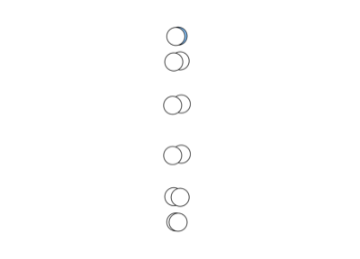</p>
<h3><a href="05/">05</a> - Chaotic Harmony</h3>
<p>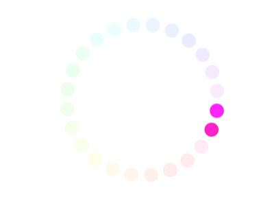</p>
<h3><a href="06/">06</a> - Sleep Harmonics I</h3>
<p>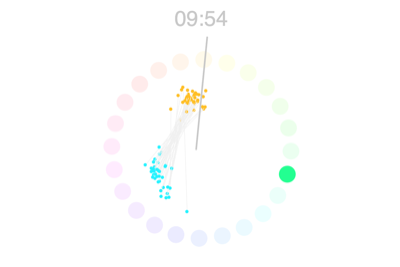</p>
<h3><a href="07/">07</a> - Sleep Harmonics II</h3>
<p>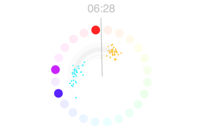</p>
<h3><a href="08/">08</a> - Sleep Harmonics III</h3>
<p>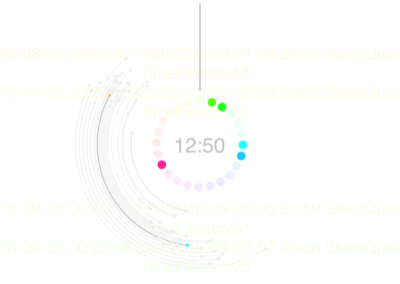</p>
<h3><a href="09/">09</a> - Emancipation from Sleep Data</h3>
<p></p>
<h3><a href="10/">10</a> - Sleep Data Abyss</h3>
<p>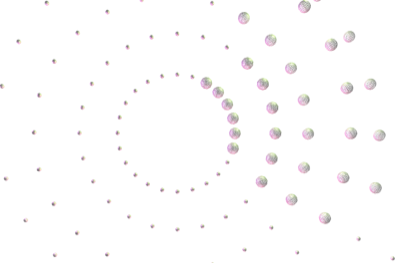</p>
<h3><a href="11/">11</a> - Sleep Data Abyss II</h3>
<p>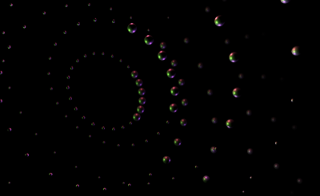</p>
<h3><a href="12/">12</a> - Sleep Data Abyss III</h3>
<p>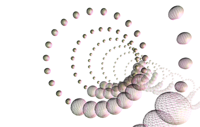</p>
<h3><a href="13/">13</a> - Ice Nine Unleashed</h3>
<p>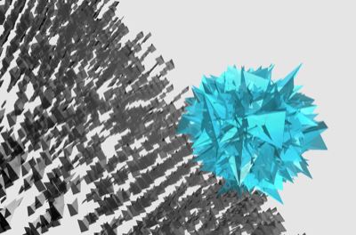</p>
<h3><a href="14/">14</a> - Green-Ice Resistance</h3>
<p></p>
<h3><a href="15/">15</a> - Post-Ice Condition</h3>
<p></p>
<h3><a href="16/">16</a> - NYC Graffiti Data</h3>
<p>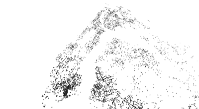</p>
<h3><a href="17/">17</a> - Glitch Outcomes</h3>
<p></p>
<h3><a href="18/">18</a> - n+1 Dimension</h3>
<p>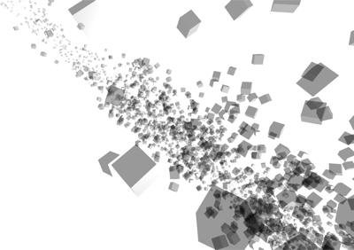</p>
<h3><a href="19/">19</a> - Data Cocoon</h3>
<p>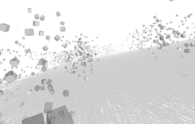</p>
<h3><a href="20/">20</a> - Sound Data Cocoon</h3>
<p></p>
<h3><a href="21/">21</a> - Data Dystopia</h3>
<p>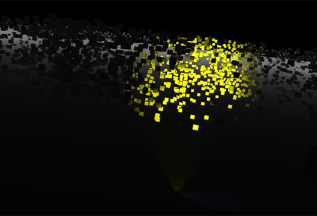</p>
<h3><a href="22/">22</a> - Data Dystopia II</h3>
<p>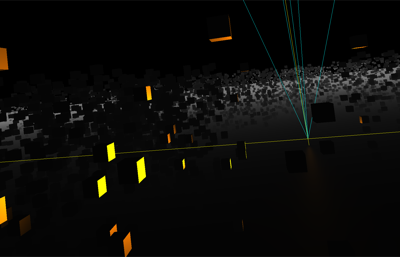</p>
<h3><a href="23/">23</a> - Sea Shell</h3>
<p></p>
<h3><a href="24/">24</a> - 4D trigonometry</h3>
<p>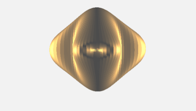</p>
<h3><a href="25/">25</a> - 4D trigonometry II</h3>
<p>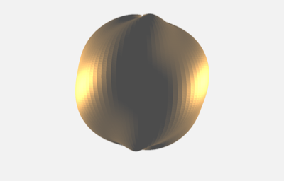</p>
<h3><a href="26/">26</a> - Polygon Planets</h3>
<p></p>
<h3><a href="27/">27</a> - Time Fabric</h3>
<p></p>
<h3><a href="28/">28</a> - Shadows</h3>
<p></p>
<h3><a href="29/">29</a> - WebGL</h3>
<p></p>
<h1>Lab-SP17</h1>
<p>Code from Lab: Collaboration, Parsons BFADT, Spring 2017</p>
<p><strong>Instructor:</strong> Aaron Lehr</p>
<h3><a href="01/">01</a> - terra-form</h3>
<h3><a href="02/">02</a> - museum-visit</h3>
<h3><a href="03/">03</a> - museum-visualization</h3>
<h3><a href="04/">04</a> - ascii</h3>
<h3><a href="https://github.com/mbrav/asciify">05</a> - ASCIIfy</h3>
<h3><a href="06/">06</a> - Web Scraping</h3>
<h3><a href="07/">07  - Midterm</a> - Wiki Faces</h3>
<h1>Lab-SP17</h1>
<p>Code from Lab: Collaboration, Parsons BFADT, Spring 2017</p>
<p><strong>Instructor:</strong> Aaron Lehr</p>
<h3><a href="01/">01</a> - terra-form</h3>
<h3><a href="02/">02</a> - museum-visit</h3>
<h3><a href="03/">03</a> - museum-visualization</h3>
<h3><a href="04/">04</a> - ascii</h3>
<h3><a href="https://github.com/mbrav/asciify">05</a> - ASCIIfy</h3>
<h3><a href="06/">06</a> - Web Scraping</h3>
<h3><a href="07/">07  - Midterm</a> - Wiki Faces</h3>
<p>test# archive
Archive of my old repos</p>
<h1>Multiverse Clockwork</h1>
<p>An openFrameworks project inspired by Clockwork Orange and nihilistic theoretical physics</p>
<p><a href="https://vimeo.com/164663100">Video</a> of the project</p>
<h2>Concept</h2>
<p>For this creative coding project I wanted imitate the animations that were popular at the time when <em>A Clockwork Orange</em> (1971) was created. During that time, computer graphics first started to emerge. I wanted to create an animation that would encompass the aspects of CG if they were to be applied in the <em>A Clockwork Orange</em> movie, but with the inclusion of a few animations that would convey multiverse theory concepts. The translation of a orange circle came out more literal than the translation of the multiverse concept, this turned out to be in parallel with their comprehensibility. The multiverse theory concepts are influenced by Jim Holt’s book <em>Why Does the World Exist?</em>.</p>
<p>The animation starts with the original <em>A Clockwork Orange</em> theme melody which signifies the low complexity of one universe. This part of the animation is very literal. Then as the music progresses into a more progressive form, the animations become more intricate, abstract, and complex. This is an attempt to convey the complexity of multiverse theories which are abstract to our comprehension as are the animations that try to represent them.</p>
<p>The way this coding project was taking its path easily emerged into such a theme and has yielded pretty satisfying results. The code itself is almost 700 lines long which gives it an ironic aspect; it is written in such a fashion that only its creator can understand.This is similar to the way multiverses can be imagined as ideas since we might not be able to comprehend their inner functioning. The way this project was coded should be a challenge for anyone’s understanding.</p>
<h2>Copyright material</h2>
<p>ClockWork Orange - Funeral Of Queen Mary</p>
<p>© A Clockwork Orange</p>
<p>Deadmau5 - Clockwork</p>
<p>© Songbird 2008</p>
<h2>Installation</h2>
<p>First, make sure you are running the <em>Raspbian</em> or <em>NOOBS</em> OS. After you have your Raspberry Pi up and running, make sure <em>pip</em> the python package manager is installed on your Raspberry Pi. If not type the following in Raspberry Pi's terminal.</p>
<p><code>$ sudo apt-get install python-pip</code><br />
Install <a href="http://flask.pocoo.org/">Flask</a> Python microframework
<code>$ sudo pip install flask</code>
Now you are ready to clone the code from GitHub, type the following
<code>$ git clone https://github.com/mixania/rpi-flask.git</code>
Now type the <code>cd</code> command to open the directory
<code>$ cd rpi-flask/</code>
Run the server as <code>sudo</code>(with root privileges)
<code>$ sudo python switch.py</code>
Your server should be running on http://127.0.0.1:80/
</p>
<h2>Description</h2>
<p><em>Stardust Music Composer</em> is an experiment that emphasizes on interactivity and visualization and combining it with music composition. Current Digital Audio Workstation (DAW) software used for music production by professionals, does not incorporate any aspects of interaction outside of the technical realm. This experimental project seeks to add a visual element to the music production process and combine it with an interactive aspect.</p>
<p>The user interacts with the interface by pressing keys that trigger audio loop samples. As the samples play music loops, the user can open a drum machine sequencer and compose a drum pattern and allowing a musical and a visual performance to be produced at the same time.</p>
<p>The visualization is composed of many particles that act like stardust. When there is a peak in the audio levels, a point of gravity is added in the visualization to which all the particles become attracted to. The user can also click on the visualization and interact with the particles. This is perhaps the most important aspect of the music composition that the experiment seeks to emphasize on. Interaction can be just as important as the process of music composition.</p>
<h2>Instructions</h2>
<ol>
<li><a href="https://processing.org/download/">Download</a> Processing</li>
<li>Install The Minim Library using the library manager in Processing</li>
<li>Download this project</li>
<li>Run the sketch by opening any one of the <em>.pde</em> files and clicking <strong>Run</strong></li>
</ol>
<h2>Copyright Material</h2>
<ul>
<li>Audio sample from Miles Davis's <em>Blue In Green</em></li>
</ul>
<h1>TechnelogicalFeudalism</h1>
<p><em>Surveilance from the time when technology was synonymous with art</em></p>
<h2>Description</h2>
<p>Technelogical Feudalism is a experimentation that explores the ways class societies where controlled before the advent of modern manipulable infrastructures. The mode of control that is explored in this particular experimentation is religion. This peace does not critique religion as a system of believe, rather, the way it is applied in societies.</p>
<p>During he Medieval Ages, which where notorious for various pandemics such such as the Black Death, humanity relied on religion as its biggest hope. Today we see how people rely on technology the same way religions where relied on during medieval ages. Technology could bring us increased life expectancy, an increase quality of life, and happiness - the same way religions where believe to. But when humanity relies on something, there is always room for exploitation, especially if that reliance is appealing to the masses.</p>
<p>This experimentation divides the user into two groups, the Noble, and the Peasant. This is an experience that is intended for multiple users where some interact with the experimentation, and other users watch how they interact on the black canvas. The Noble is able to track the mouse portion and clicks. Multiple windows can be opened to simulate the interaction between multiple people.</p>
<p>The peasant side is given an opportunity to accept religion and is given an semi-interactive environment. On the other side of the user, there is a person who looks at his actions. The very fact that he can monitor the actions of the Peasant, means that he is more manipulable. Religion here, is served as a form of entertainment that also translated into a form of surveilance and establishments of control.</p>
<h2>Navigation</h2>
<h4>User chooses his class</h4>
<p>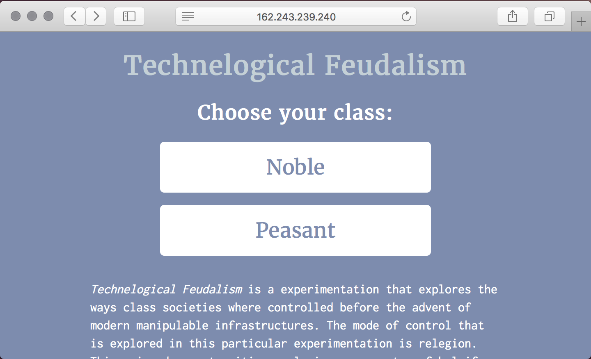</p>
<h4>Peasant's screen</h4>
<p>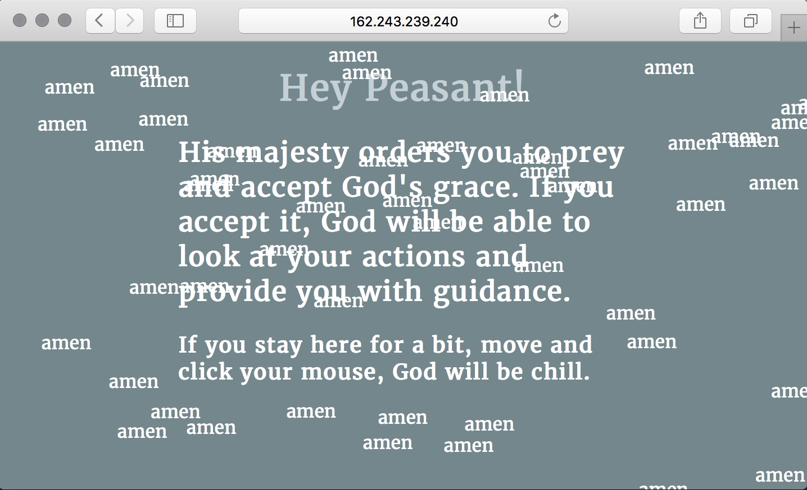</p>
<h4>You become noble by claiming an oath</h4>
<p>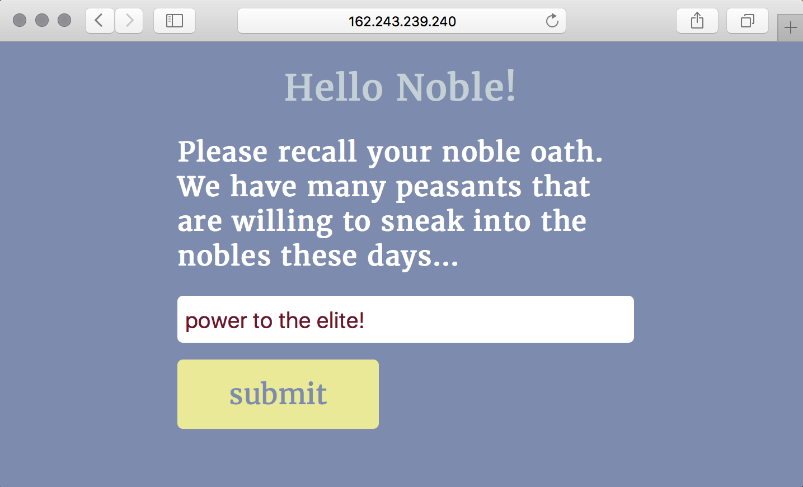</p>
<h4>The noble can now spy on peasants</h4>
<p>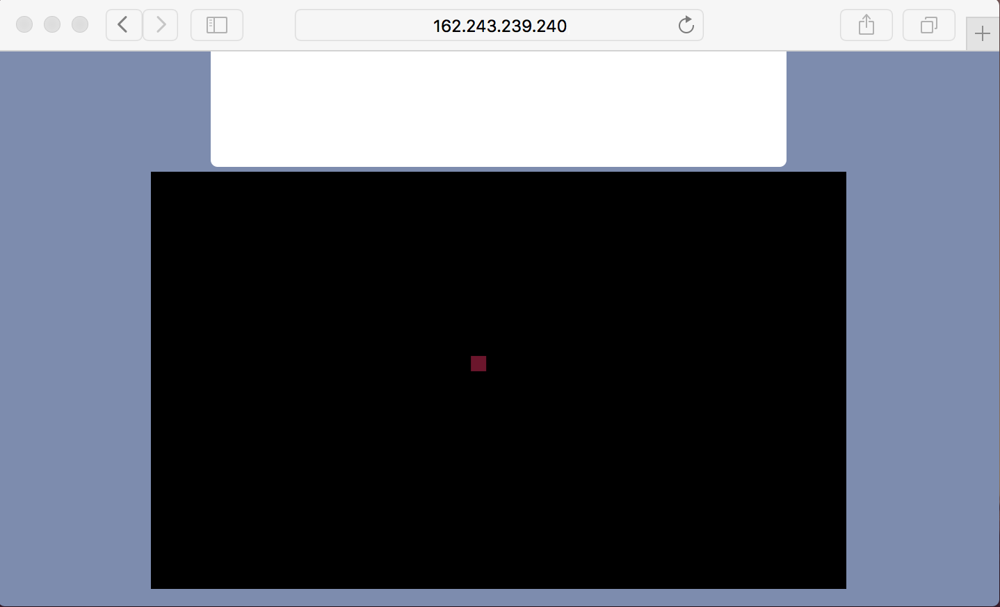</p>
<h1>yogabot</h1>
<p>An instagram bot with a set of methodologies that attempt to steal SMM leads from competitor businesses. </p>
<h2>Todo fixes</h2>
<ul>
<li>[x] Interact with feed function <code>feedinteract()</code></li>
<li>[ ] Interact with likers/folowers of competitors </li>
<li>[ ] Follow function <code>follow()</code></li>
<li>[ ] Unfollow function <code>unfollow()</code>s</li>
</ul>
=======
# New York Data City
NYDC is a project that explores the conventional aspects of data representation. Data visualization is frequently used to convey information using highly abstracted visual and vocabulary symbols. In some cases, humans can only interpret data only because a symbolic reference is provide along the visualization.

Data visualization can be politicized and manipulated through symbols. It can force the viewer to interpret the data in a very intentional and particular way. The semantic symbols in a data visualization, can sometimes become the most significant factor to dictate the viewer’s interpretation of the data. People frequently use terms like “let data speak for itself” as a substitute to meaningful informational representation. Data can be represented in more abstract forms that may convey its inherit nature and its meaningfulness.

[Visual 01](https://mbrav.github.io/nydc/01/index.html) - NYC Farmer Markets ([data source](https://data.cityofnewyork.us/Health/New-York-City-Farmers-Markets/j8gx-kc43/data))

[Visual 02](https://mbrav.github.io/nydc/02/index.html) - NYC Water Complaints ([data source](https://data.cityofnewyork.us/Environment/Water-Quality-complaints/qfe3-6dkn/data))

[Visual 03](https://mbrav.github.io/nydc/03/index.html) - NYC Greenthumb Community Gardens ([data source](https://data.cityofnewyork.us/Environment/NYC-Greenthumb-Community-Gardens/ajxm-kzmj))

[Visual 04](https://mbrav.github.io/nydc/04/index.html) - NYC Cool Roof Buildings ([data source](https://data.cityofnewyork.us/Environment/NYC-Cool-Roofs-Buildings/uuxn-wzxe/data))

[Visual 05](https://mbrav.github.io/nydc/05/index.html) - NYC Food Scrap Drop Of Sites ([data source](https://data.cityofnewyork.us/Environment/Food-Scrap-Drop-Off-Sites/rmmq-46n5/data))

[Visual 06](https://mbrav.github.io/nydc/06/index.html) - NYC Projects in Construction ([data source](https://nycopendata.socrata.com/Housing-Development/Projects-in-Construction-Map/dzgh-ja44/data))

[Visual 07](https://mbrav.github.io/nydc/07/index.html) - .nyc Domain Registration by Zip Code ([data source](https://data.cityofnewyork.us/Business/-nyc-Domain-Registrations-by-Zip-Code/ymvu-4x4s/data))

[Visual 08](https://mbrav.github.io/nydc/08/index.html) - NYC Approved Wholesale Markets ([data source](https://data.cityofnewyork.us/Business/Approved-registrants-in-the-wholesale-markets/sapz-4gsi))

[Visual 09](https://mbrav.github.io/nydc/09/index.html) - NYC Public Recycling Bins ([data source](https://data.cityofnewyork.us/Environment/Public-Recycling-Bins/sxx4-xhzg/data))

[Visual 10](https://mbrav.github.io/nydc/10/index.html) - NYC Health and Hospital Corporation (HHC) Facilities ([data source](https://data.cityofnewyork.us/Health/NYC-Health-and-Hospitals-Corporation-Facilities/ymhw-9cz9/data))

[Visual 11](https://mbrav.github.io/nydc/11/index.html) - NYDC Combined visualization


## Instructions

Use the ```W```,```A```,```S```, and```D``` keys to navigate forwards, left , back, and right.

Use ```Q``` and ```E``` to rotate the camera.

Use the mouse to stir the direction.

**Does not yet support mobile device movement**  

## Process

[utils](https://github.com/mbrav/nydc/tree/master/utils) - a set of utilities that where used for geocoding and parsing the data.

The converted data can be [found here](https://github.com/mbrav/nydc/tree/master/data) as .js files.

Some of the parts of this project are based on [graffiti-data](https://github.com/mbrav/nydc/tree/master/graffiti).

Geocoding [NYC Greenthumb Community Gardens](https://youtu.be/WlM96wBV5nU) using Google's API

Geocoding [NYC Farmer Markets](https://youtu.be/byGIZ4QIHOM) using Google's API

### Made with

* [three.js](https://threejs.org/) and WebGL
* [NYC Open Data](https://nycopendata.socrata.com/) 

## Influence

Cao Fei's - [RMB City](https://www.youtube.com/watch?v=9MhfATPZA0g)

Cao Fei's - [China Tracy](https://www.youtube.com/watch?v=5vcR7OkzHkI)
>>>>>>> nydc/master
