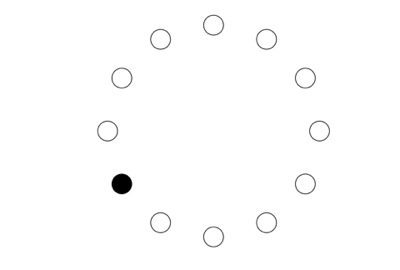
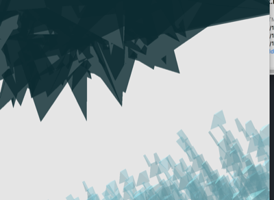
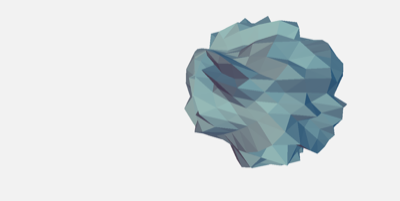
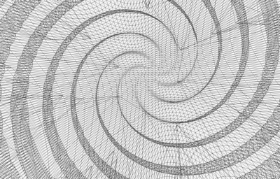

# Core Lab: Systems

**Instructors**: Miri Park & Bryan Collinsworth

Fall 2016

## Sketches

### [02](02/) - Random Sequence

### [03](03/) - Fibonacci Sequence

### [04](04/) - Fibonacci Sequence & Composition

### [05](05/) - Chaotic Harmony

### [06](06/) - Sleep Harmonics I

### [07](07/) - Sleep Harmonics II

### [08](08/) - Sleep Harmonics III

### [09](09/) - Emancipation from Sleep Data

### [10](10/) - Sleep Data Abyss

### [11](11/) - Sleep Data Abyss II

### [12](12/) - Sleep Data Abyss III

### [13](13/) - Ice Nine Unleashed

### [14](14/) - Green-Ice Resistance

### [15](15/) - Post-Ice Condition

### [16](16/) - NYC Graffiti Data

### [17](17/) - Glitch Outcomes

### [18](18/) - n+1 Dimension

### [19](19/) - Data Cocoon

### [20](20/) - Sound Data Cocoon

### [21](21/) - Data Dystopia

### [22](22/) - Data Dystopia II

### [23](23/) - Sea Shell

### [24](24/) - 4D trigonometry

### [25](25/) - 4D trigonometry II

### [26](26/) - Polygon Planets

### [27](27/) - Time Fabric

### [28](28/) - Shadows

### [29](29/) - WebGL

